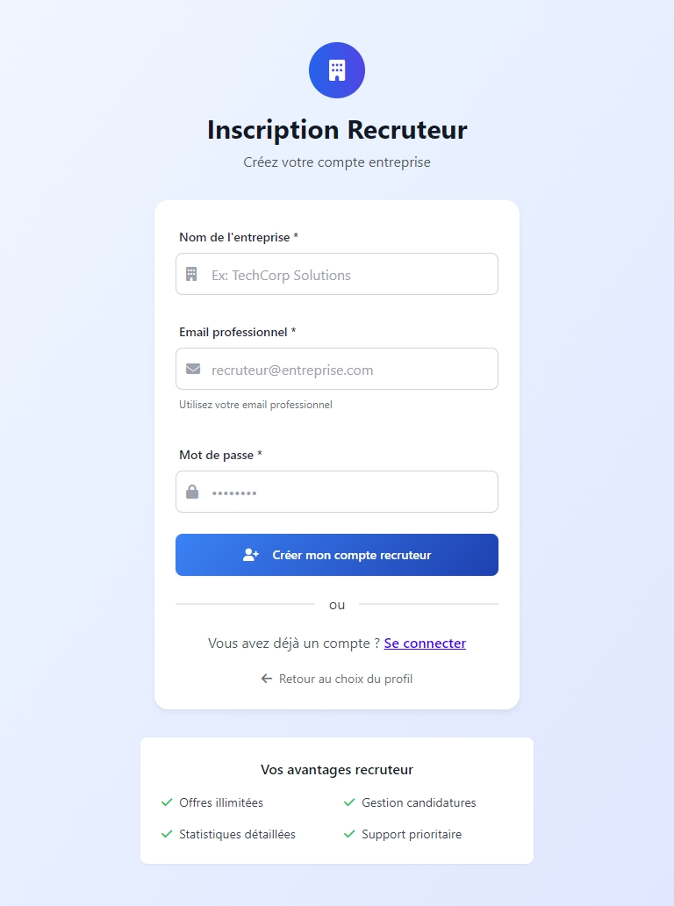
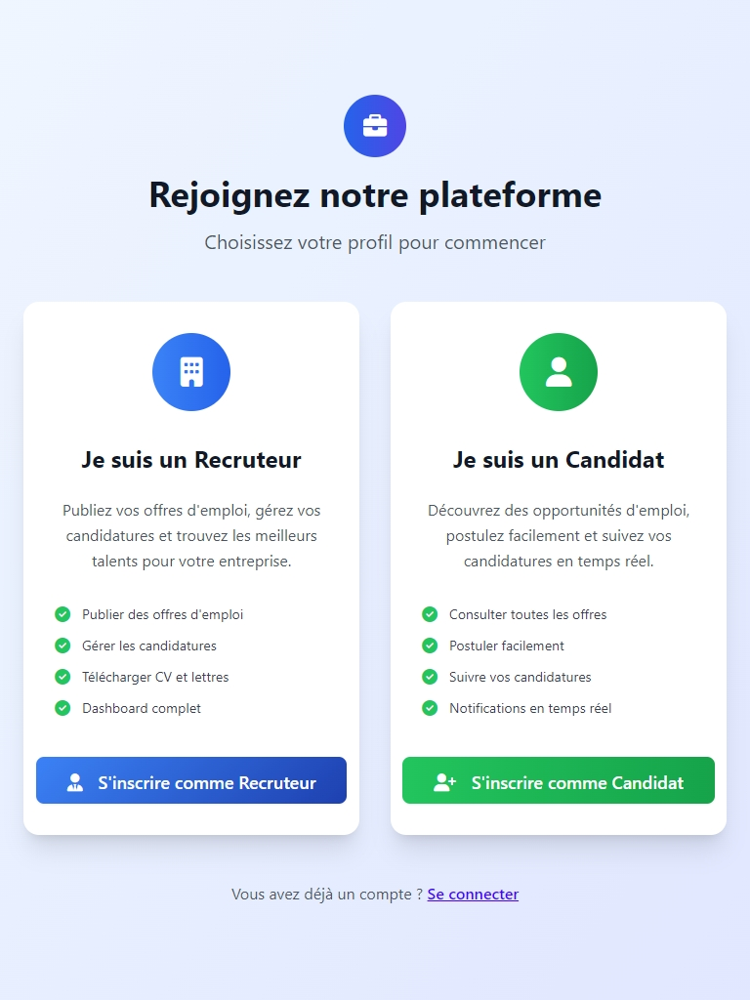
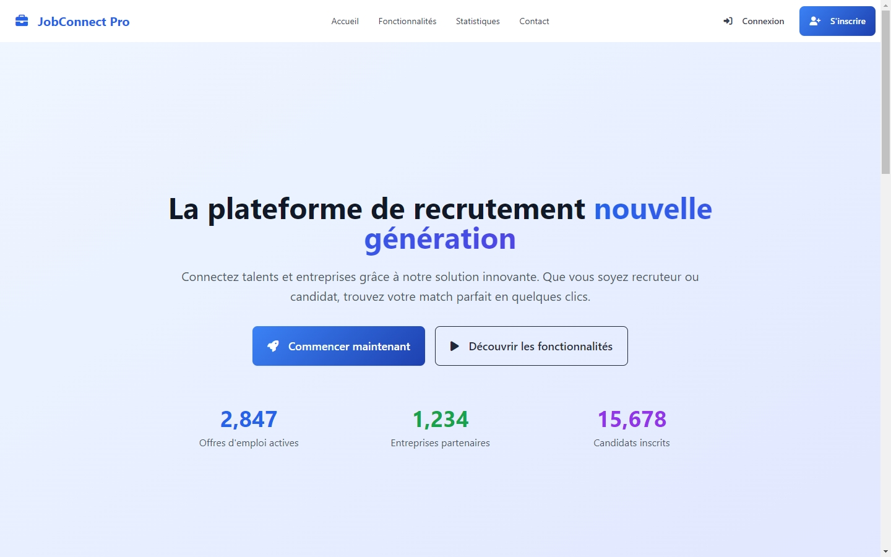
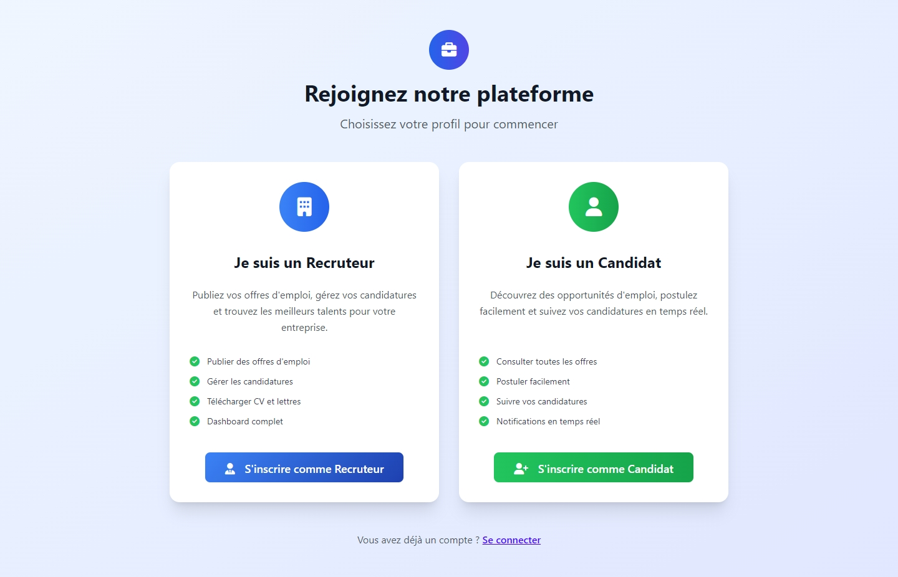

# Plateforme de Recrutement en Ligne

Une plateforme complète de recrutement développée avec HTML, CSS et DaisyUI, sans JavaScript, offrant une interface moderne et responsive pour les recruteurs et les candidats.

## 🚀 Fonctionnalités

### Pour les Recruteurs

- **Dashboard complet** avec statistiques et vue d'ensemble
- **Gestion des offres d'emploi** : création, modification, suppression
- **Gestion des candidatures** : consultation, acceptation, refus
- **Téléchargement des CV et lettres de motivation**
- **Notifications automatiques** aux candidats
- **Interface intuitive** pour la gestion des recrutements

### Pour les Candidats

- **Consultation des offres** avec filtres avancés
- **Candidature simplifiée** avec upload de CV et lettre
- **Suivi des candidatures** en temps réel
- **Notifications** sur l'évolution des candidatures
- **Interface responsive** adaptée à tous les appareils

## 📁 Structure du Projet

```
recrutement-platform/
├── index.html                          # Page d'accueil générale
├── css/
│   └── style.css                       # Styles personnalisés avec DaisyUI
├── js/
│   └── pagination.js 			# Javascript pou gere la pagination
├── images/                             # Dossier pour les images
└── pages/
    ├── auth/                           # Pages d'authentification
    │   ├── login.html                  # Connexion
    │   ├── register-choice.html        # Choix du type d'inscription
    │   ├── register-recruteur.html     # Inscription recruteur
    │   └── register-candidat.html      # Inscription candidat
    ├── recruteur/                      # Interface recruteur
    │   ├── dashboard.html              # Dashboard principal
    │   ├── ajouter-offre.html          # Création d'offre
    │   ├── modifier-offre.html         # Modification d'offre
    │   └── detail-offre.html           # Détail offre + candidatures
    └── candidat/                       # Interface candidat
        ├── offres.html                 # Liste des offres
        ├── detail-offre-candidat.html  # Détail offre + candidature
        └── mes-candidatures.html       # Suivi des candidatures
```

## 🎨 Technologies Utilisées

- **HTML5** : Structure sémantique des pages
- **CSS3** : Styles personnalisés et animations
- **DaisyUI** : Framework CSS basé sur Tailwind CSS
- **Tailwind CSS** : Classes utilitaires pour le styling
- **JavaScript** : Pour la pagination et les interactions dynamiques

## 📋 Caractéristiques d'une Offre d'Emploi

Chaque offre d'emploi comprend :

- **Nom du poste**
- **Nom de l'entreprise**
- **Type de contrat** (CDI, CDD, Stage)
- **Statut de l'offre** (Active, Inactive, Fermée)
- **Localisation** de l'entreprise
- **Compétences demandées**
- **Nombre de candidats attendus**
- **Fourchette salariale** (minimum et maximum)
- **Description détaillée** du poste
- **Avantages** proposés

## 👥 Gestion des Utilisateurs

### Inscription Recruteur

- Email professionnel
- Mot de passe
- Nom de l'entreprise
- Secteur d'activité
- Taille de l'entreprise

### Inscription Candidat

- Email
- Mot de passe
- Nom et prénom
- Téléphone (optionnel)
- Localisation
- Niveau d'expérience
- Domaine de compétence

## 🔄 Processus de Candidature

1. **Consultation** des offres par les candidats
2. **Candidature** avec CV et lettre de motivation
3. **Réception** et tri par les recruteurs
4. **Décision** : acceptation ou refus
5. **Notification** automatique au candidat
6. **Suivi** de l'évolution dans l'interface candidat

## 🎯 Fonctionnalités Spéciales

### Interface Recruteur

- Vue uniquement des offres créées par le recruteur connecté
- Statistiques en temps réel
- Gestion complète du cycle de recrutement
- Interface de téléchargement des documents

### Interface Candidat

- Accès à toutes les offres disponibles
- Système de sauvegarde des offres favorites
- Suivi détaillé des candidatures
- Possibilité de retirer une candidature

## 🎨 Design et UX

- **Design moderne** avec dégradés et animations CSS
- **Interface responsive** adaptée mobile et desktop
- **Navigation intuitive** avec breadcrumbs
- **Feedback visuel** avec toasts et alertes
- **Thème cohérent** avec palette de couleurs professionnelle
- **Accessibilité** respectée avec contrastes appropriés

## 📱 Responsive Design

L'interface s'adapte automatiquement à tous les types d'écrans :

- **Desktop** : Interface complète avec sidebar
- **Tablet** : Adaptation des grilles et navigation
- **Mobile** : Menu hamburger et layout vertical

## 🔧 Installation et Utilisation

1. Téléchargez ou clonez le projet
2. Ouvrez `index.html` dans votre navigateur
3. Naviguez vers les différentes sections :
   - Recruteurs : `pages/auth/register-recruteur.html`
   - Candidats : `pages/auth/register-candidat.html`

## 📊 Données Fictives Incluses

Le projet contient des données d'exemple pour :

- **5 offres d'emploi** variées (CDI, CDD, Stage)
- **12 candidatures** avec différents statuts
- **Profils d'entreprises** diversifiés
- **Candidats fictifs** avec compétences variées

## 🚫 Limitations Techniques

- **Ajout de JavaScript pour la pagination** : Les pages `dashboard.html`, `offres.html` et `mes-candidatures.html` utilisent désormais JavaScript pour gérer la pagination des listes d'éléments.
- **Pas de base de données** : Aucune persistance des données
- **Navigation simulée** : Les liens redirigent vers les pages correspondantes

## 🎯 Cas d'Usage

Cette plateforme est idéale pour :

- **Démonstration** d'interfaces de recrutement
- **Prototype** pour validation de concept
- **Formation** sur les interfaces web modernes
- **Base** pour développement avec backend

## 📈 Évolutions Possibles

- Intégration d'un backend (Node.js, PHP, Python)
- Ajout de JavaScript pour les interactions
- Système d'authentification réel
- Base de données pour la persistance
- API REST pour les échanges de données
- Système de notifications en temps réel
- Chat intégré entre recruteurs et candidats





---

**Développé avec ❤️ en utilisant HTML, CSS et DaisyUI**
